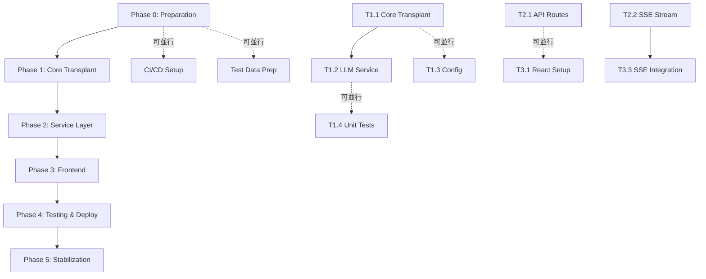

# TeacherAssist V2 實施工作流程
## PPTAgent 重構執行計劃 (Enterprise-Grade)

**計劃版本**: v1.0
**創建日期**: 2025-12-30
**基於文檔**: [architectural_analysis_report.md](architectural_analysis_report.md)
**源碼參考**: `refData/PPTAgent-main/`
**實施策略**: Enterprise | 深度分析 | 並行執行
**效能焦點**: Performance optimization with caching and monitoring

---

## 執行摘要

### 🎯 項目範圍

**目標**: 將 TeacherAssist 從 Presenton (黑盒 Docker 容器) 遷移到 PPTAgent/DeepPresenter (現代、可擴展架構)

**實施選項**: **Option A (MVP)** - PPTAgent 核心移植 + 現代前端

**預期時間**: 5-6 週 (含 20% 緩衝)
- Phase 0: Week 0 (準備階段)
- Phase 1-4: Week 1-4 (MVP 開發)
- Phase 5: Week 5 (穩定化)
- Future: Week 6+ (Option B/C 可選功能)

### 📊 成功標準

**技術指標**:
- ✅ 效能: 10 頁簡報 < 2 分鐘 (P95, Ollama 本地)
- ✅ 穩定性: 99% 生成成功率
- ✅ 測試覆蓋率: ≥ 80% 單元測試，100% E2E 關鍵路徑
- ✅ 原生 ARM64 支持 (無 Docker 模擬)

**業務指標**:
- ✅ 功能等同或優於 Presenton
- ✅ 實時進度回饋 (SSE 串流)
- ✅ 多 LLM 提供者支持 (Ollama + OpenAI)
- ✅ 用戶滿意度 ≥ 90% (survey)

### 🏗️ 架構概覽

```
┌─────────────────────────────────────────────────────────────┐
│                    React Frontend (Vite)                    │
│  Tailwind CSS + shadcn/ui + Framer Motion + TypeScript     │
└──────────────────┬──────────────────────────────────────────┘
                   │ REST API + SSE
┌──────────────────▼──────────────────────────────────────────┐
│              FastAPI Backend (Python 3.11+)                 │
│                                                             │
│  ┌────────────────────────────────────────────────────────┐ │
│  │          PPTAgent Core (Transplanted)                  │ │
│  │  agent.py │ apis.py │ pptgen.py │ induct.py │ llms.py │ │
│  │  presentation/ │ response/ │ roles/ │ prompts/        │ │
│  └────────────────────────────────────────────────────────┘ │
│                                                             │
│  ┌────────────────────────────────────────────────────────┐ │
│  │    Service Layer (新增)                                │ │
│  │  PresentationService │ TemplateManager │ LLMService    │ │
│  │  CacheService │ MonitoringService                      │ │
│  └────────────────────────────────────────────────────────┘ │
└──────────────────┬──────────────────────────────────────────┘
                   │
┌──────────────────▼──────────────────────────────────────────┐
│       LLM Providers + Infrastructure                        │
│  Ollama (local) │ OpenAI (cloud) │ Redis │ Prometheus      │
└─────────────────────────────────────────────────────────────┘
```

---

## Phase 0: 準備階段 (Week 0)

**目標**: 建立開發環境、驗證依賴、準備測試數據

**負責人**: DevOps Engineer + Architecture Lead

### 任務清單

#### 📋 T0.1: 環境設置與驗證

**輸入**: 開發機器、網路連接
**輸出**: 完全配置的開發環境
**預計時間**: 4 小時
**並行度**: 可並行 (多開發者獨立設置)

**步驟**:

1. **Python 環境** (2h)
   ```bash
   # 驗證 Python 版本
   python --version  # 需要 3.11+

   # 創建虛擬環境
   cd /path/to/TeacherAssist_V2
   python -m venv venv
   source venv/bin/activate  # Linux/Mac
   # or: venv\Scripts\activate  # Windows

   # 升級 pip
   pip install --upgrade pip setuptools wheel
   ```

2. **Node.js 環境** (1h)
   ```bash
   # 驗證 Node.js 版本
   node --version  # 需要 18+
   npm --version   # 需要 9+

   # 如果版本不足，使用 nvm 安裝
   # curl -o- https://raw.githubusercontent.com/nvm-sh/nvm/v0.39.0/install.sh | bash
   # nvm install 18
   # nvm use 18
   ```

3. **Ollama 設置** (1h)
   ```bash
   # 安裝 Ollama (如果尚未安裝)
   # Linux: curl -fsSL https://ollama.com/install.sh | sh
   # Mac: brew install ollama

   # 啟動 Ollama 服務
   ollama serve &

   # 下載模型 (根據計劃使用的模型)
   ollama pull qwen2.5:7b
   ollama pull llama3:8b  # 備用

   # 測試 Ollama
   curl http://localhost:11434/api/tags  # 應該列出已下載的模型
   ```

**驗收標準**:
- ✅ Python 3.11+ 已安裝並可用
- ✅ Node.js 18+ 已安裝並可用
- ✅ Ollama 運行並至少有一個模型可用
- ✅ 網路連接正常 (可訪問 PyPI, npm registry)

---

#### 📋 T0.2: 項目結構創建

**輸入**: 環境驗證完成
**輸出**: 完整的項目目錄結構
**預計時間**: 2 小時
**並行度**: 順序 (依賴 T0.1)

**步驟**:

1. **創建目錄結構** (1h)
   ```bash
   cd /path/to/TeacherAssist_V2

   # Backend structure
   mkdir -p backend/app/pptagent_core/{presentation,response,roles,prompts,document}
   mkdir -p backend/app/services
   mkdir -p backend/app/api/{routes,schemas}
   mkdir -p backend/app/core
   mkdir -p backend/tests/{unit,integration,e2e}
   mkdir -p backend/data/{templates,outputs,cache}

   # Frontend structure
   mkdir -p frontend/src/{components,hooks,api,utils,types,styles}
   mkdir -p frontend/src/components/{input,template,generation,preview}
   mkdir -p frontend/public

   # Infrastructure
   mkdir -p infra/{docker,k8s,scripts}
   mkdir -p docs/{api,user,admin}

   # Create __init__.py files
   find backend/app -type d -exec touch {}/__init__.py \;
   ```

2. **創建基礎配置文件** (1h)
   ```bash
   # Backend pyproject.toml
   cat > backend/pyproject.toml << 'EOF'
   [project]
   name = "teacherassist-backend"
   version = "2.0.0"
   description = "TeacherAssist V2 Backend with PPTAgent"
   requires-python = ">=3.11"
   dependencies = [
       "fastapi>=0.104.0",
       "uvicorn[standard]>=0.24.0",
       "pydantic>=2.11.9",
       "pydantic-settings>=2.0.0",
       "pptagent-pptx>=0.2.0",
       "openai>=1.108.2",
       "aiohttp>=3.8.0",
       "jinja2>=3.1.6",
       "pillow>=9.0.0",
       "pyyaml>=6.0.0",
       "redis>=5.0.0",
       "python-multipart>=0.0.6",
   ]

   [project.optional-dependencies]
   dev = [
       "pytest>=7.0.0",
       "pytest-asyncio>=0.21.0",
       "pytest-cov>=4.0.0",
       "black>=23.0.0",
       "ruff>=0.1.0",
       "mypy>=1.0.0",
   ]

   [build-system]
   requires = ["setuptools>=68.0"]
   build-backend = "setuptools.build_meta"
   EOF

   # Frontend package.json
   cat > frontend/package.json << 'EOF'
   {
     "name": "teacherassist-frontend",
     "version": "2.0.0",
     "type": "module",
     "scripts": {
       "dev": "vite",
       "build": "tsc && vite build",
       "preview": "vite preview",
       "lint": "eslint . --ext ts,tsx --report-unused-disable-directives --max-warnings 0"
     },
     "dependencies": {
       "react": "^18.2.0",
       "react-dom": "^18.2.0",
       "react-router-dom": "^6.20.0",
       "framer-motion": "^10.16.0",
       "@tanstack/react-query": "^5.8.0",
       "axios": "^1.6.0"
     },
     "devDependencies": {
       "@types/react": "^18.2.37",
       "@types/react-dom": "^18.2.15",
       "@typescript-eslint/eslint-plugin": "^6.10.0",
       "@typescript-eslint/parser": "^6.10.0",
       "@vitejs/plugin-react": "^4.2.0",
       "typescript": "^5.2.2",
       "vite": "^5.0.0",
       "tailwindcss": "^3.3.5",
       "autoprefixer": "^10.4.16",
       "postcss": "^8.4.31",
       "eslint": "^8.53.0"
     }
   }
   EOF

   # .gitignore
   cat > .gitignore << 'EOF'
   # Python
   __pycache__/
   *.py[cod]
   *$py.class
   venv/
   .env
   *.egg-info/
   dist/
   build/

   # Node
   node_modules/
   frontend/dist/
   frontend/.vite/

   # IDE
   .vscode/
   .idea/
   *.swp
   *.swo

   # Data
   backend/data/outputs/*
   backend/data/cache/*
   !backend/data/.gitkeep

   # OS
   .DS_Store
   Thumbs.db
   EOF
   ```

**驗收標準**:
- ✅ 所有目錄結構已創建
- ✅ pyproject.toml 和 package.json 已創建
- ✅ .gitignore 已配置
- ✅ 目錄結構符合架構設計

---

#### 📋 T0.3: 依賴安裝與驗證

**輸入**: 項目結構已創建
**輸出**: 所有依賴已安裝並驗證
**預計時間**: 3 小時
**並行度**: Backend 和 Frontend 可並行

**步驟**:

1. **Backend 依賴** (1.5h)
   ```bash
   cd backend
   pip install -e ".[dev]"

   # 驗證關鍵依賴
   python -c "import fastapi; print(f'FastAPI: {fastapi.__version__}')"
   python -c "import pptagent_pptx; print('pptagent-pptx: OK')" || echo "⚠️ pptagent-pptx not found"
   python -c "import openai; print(f'OpenAI: {openai.__version__}')"
   python -c "import redis; print(f'Redis: {redis.__version__}')"

   # 如果 pptagent-pptx 不可用，需要處理 (見 T0.4)
   ```

2. **Frontend 依賴** (1.5h) - **可並行**
   ```bash
   cd frontend
   npm install

   # 安裝 shadcn/ui CLI
   npx shadcn-ui@latest init
   # 選擇: TypeScript, Tailwind, src/ directory

   # 驗證關鍵依賴
   npm list react react-dom vite tailwindcss
   ```

**驗收標準**:
- ✅ Backend 所有依賴已安裝
- ✅ Frontend 所有依賴已安裝
- ✅ 無依賴衝突或錯誤
- ✅ shadcn/ui 已初始化

---

#### 📋 T0.4: pptagent-pptx 依賴處理

**輸入**: 依賴安裝完成
**輸出**: pptagent-pptx 可用並驗證
**預計時間**: 2 小時
**並行度**: 順序 (依賴 T0.3)

**策略選擇** (根據架構分析報告的風險緩解):

**選項 1: PyPI 包 (首選)**
```bash
pip install pptagent-pptx>=0.2.0
python -c "import pptagent_pptx; print('Success')"
```

**選項 2: 從源碼安裝 (如果 PyPI 不可用)**
```bash
# 需要獲取 pptagent-pptx 源碼 (可能需要從 GitHub 克隆)
git clone https://github.com/yourusername/pptagent-pptx.git temp_pptx
cd temp_pptx
pip install -e .
cd ..
```

**選項 3: Vendor (最後手段)**
```bash
# 將 pptagent-pptx 複製到項目中
cp -r /path/to/pptagent-pptx backend/app/vendor/pptagent_pptx
# 更新導入路徑
```

**Fallback: python-pptx** (如果所有選項都失敗)
```bash
pip install python-pptx>=0.6.21
# 需要修改 PPTAgent 代碼以適配標準 python-pptx API
# 這會增加額外的開發工作 (2-3 天)
```

**驗收標準**:
- ✅ pptagent-pptx 或 fallback 解決方案可用
- ✅ 可以成功導入和使用 PPTX 操作
- ✅ 測試腳本驗證基本 PPTX 操作

---

#### 📋 T0.5: 測試數據準備

**輸入**: 項目結構和依賴已就緒
**輸出**: 完整的測試數據集
**預計時間**: 4 小時
**並行度**: 可並行 (與其他任務)

**步驟**:

1. **範例模板準備** (2h)
   ```bash
   # 從 PPTAgent 源碼複製範例模板
   cp -r refData/PPTAgent-main/pptagent/pptagent/templates/* \
         backend/data/templates/

   # 驗證模板結構
   ls -l backend/data/templates/
   # 應該看到: default/, beamer/, cip/, hit/, thu/, ucas/
   ```

2. **測試內容準備** (1h)
   ```bash
   # 創建測試 Markdown 文件
   cat > backend/data/test_content_01.md << 'EOF'
   # AI 技術簡介

   ---

   ## 什麼是人工智慧？

   人工智慧 (Artificial Intelligence, AI) 是計算機科學的一個分支。

   ---

   ## 機器學習基礎

   - 監督學習
   - 非監督學習
   - 強化學習

   ---

   ## 深度學習

   神經網路架構和應用

   ---

   ## 未來展望

   AI 將如何改變世界
   EOF

   # 創建更多測試文件 (不同長度、格式)
   # ...
   ```

3. **基準測試數據** (1h)
   ```bash
   # 使用 Presenton (如果還在運行) 生成基準簡報
   # 記錄生成時間、質量評估

   # 創建基準記錄文件
   cat > backend/data/baseline_metrics.json << 'EOF'
   {
     "presenton_baseline": {
       "10_slides_generation_time_seconds": 180,
       "quality_score": 7.5,
       "success_rate": 0.95,
       "template": "default"
     }
   }
   EOF
   ```

**驗收標準**:
- ✅ 至少 5 個不同的 PPTX 模板已準備
- ✅ 至少 10 個測試 Markdown 內容文件 (不同長度、格式)
- ✅ 基準測試數據已記錄
- ✅ 測試數據結構已文檔化

---

#### 📋 T0.6: CI/CD 基礎設置

**輸入**: 項目結構已創建
**輸出**: 基本 CI pipeline 配置
**預計時間**: 3 小時
**並行度**: 可並行 (DevOps 獨立進行)

**步驟**:

1. **GitHub Actions 配置** (2h)
   ```yaml
   # .github/workflows/ci.yml
   name: CI

   on:
     push:
       branches: [ main, develop ]
     pull_request:
       branches: [ main ]

   jobs:
     backend-tests:
       runs-on: ubuntu-latest
       steps:
         - uses: actions/checkout@v3
         - name: Set up Python
           uses: actions/setup-python@v4
           with:
             python-version: '3.11'
         - name: Install dependencies
           run: |
             cd backend
             pip install -e ".[dev]"
         - name: Lint with ruff
           run: |
             cd backend
             ruff check .
         - name: Test with pytest
           run: |
             cd backend
             pytest tests/ --cov=app --cov-report=xml
         - name: Upload coverage
           uses: codecov/codecov-action@v3

     frontend-tests:
       runs-on: ubuntu-latest
       steps:
         - uses: actions/checkout@v3
         - name: Set up Node.js
           uses: actions/setup-node@v3
           with:
             node-version: '18'
         - name: Install dependencies
           run: |
             cd frontend
             npm ci
         - name: Lint
           run: |
             cd frontend
             npm run lint
         - name: Build
           run: |
             cd frontend
             npm run build
   ```

2. **Pre-commit hooks** (1h)
   ```yaml
   # .pre-commit-config.yaml
   repos:
     - repo: https://github.com/pre-commit/pre-commit-hooks
       rev: v4.5.0
       hooks:
         - id: trailing-whitespace
         - id: end-of-file-fixer
         - id: check-yaml
         - id: check-json

     - repo: https://github.com/psf/black
       rev: 23.11.0
       hooks:
         - id: black
           language_version: python3.11

     - repo: https://github.com/astral-sh/ruff-pre-commit
       rev: v0.1.6
       hooks:
         - id: ruff
           args: [ --fix, --exit-non-zero-on-fix ]
   ```

   ```bash
   # 安裝 pre-commit
   pip install pre-commit
   pre-commit install

   # 測試 pre-commit
   pre-commit run --all-files
   ```

**驗收標準**:
- ✅ GitHub Actions workflow 已配置
- ✅ Pre-commit hooks 已安裝並可運行
- ✅ Lint 和基本測試可通過 CI 執行

---

#### 📋 T0.7: 團隊對齊與文檔

**輸入**: 所有 Phase 0 任務接近完成
**輸出**: 團隊對齊會議記錄和文檔
**預計時間**: 2 小時
**並行度**: 團隊會議 (所有人參與)

**步驟**:

1. **技術設計評審** (1h)
   - 評審架構分析報告
   - 確認技術選型
   - 討論潛在風險和緩解策略
   - 分配角色和責任

2. **文檔更新** (1h)
   ```bash
   # 創建 README.md
   cat > README.md << 'EOF'
   # TeacherAssist V2

   ## 項目概述
   TeacherAssist V2 是基於 PPTAgent 的現代化簡報生成系統，替代原有的 Presenton 引擎。

   ## 快速開始

   ### 環境要求
   - Python 3.11+
   - Node.js 18+
   - Ollama (本地 LLM)

   ### 安裝
   \`\`\`bash
   # Backend
   cd backend && pip install -e ".[dev]"

   # Frontend
   cd frontend && npm install
   \`\`\`

   ## 架構
   [查看架構分析報告](docs/architectural_analysis_report.md)

   ## 開發指南
   [查看實施工作流程](docs/implementation_workflow.md)
   EOF

   # 創建 DEVELOPMENT.md
   # 創建 CONTRIBUTING.md
   # 更新 docs/api/ 文檔骨架
   ```

**驗收標準**:
- ✅ 技術設計評審會議已完成
- ✅ 團隊角色和責任已明確
- ✅ README.md 已創建
- ✅ 開發文檔骨架已建立

---

### Phase 0 質量門檻 (Definition of Done)

在進入 Phase 1 之前，必須滿足以下所有條件:

- [x] **環境驗證**: Python 3.11+, Node.js 18+, Ollama 運行並有模型
- [x] **項目結構**: 完整的 backend/ 和 frontend/ 目錄結構已創建
- [x] **依賴管理**: 所有依賴已安裝，無衝突
- [x] **pptagent-pptx**: 已解決（PyPI / vendor / fallback）
- [x] **測試數據**: 至少 5 個模板和 10 個測試內容已準備
- [x] **CI/CD**: GitHub Actions 和 pre-commit hooks 已配置
- [x] **文檔**: README, DEVELOPMENT 已創建
- [x] **團隊對齊**: 所有成員理解架構和計劃

**驗證方式**:
```bash
# 執行驗證腳本
./scripts/phase0_validation.sh
# 應該輸出: "✅ Phase 0 完成，可以進入 Phase 1"
```

---

## Phase 1: 核心移植 (Week 1)

**目標**: 移植 PPTAgent 核心模組到項目中

**負責人**: Backend Developer + Architecture Lead

### 任務清單

#### 📋 T1.1: PPTAgent 核心模組移植

**輸入**: Phase 0 完成，PPTAgent 源碼已分析
**輸出**: PPTAgent 核心模組已移植並可導入
**預計時間**: 8 小時
**並行度**: 可按模組並行 (多開發者)

**核心文件映射**:

```
refData/PPTAgent-main/pptagent/pptagent/
├── agent.py          → backend/app/pptagent_core/agent.py
├── apis.py           → backend/app/pptagent_core/apis.py
├── induct.py         → backend/app/pptagent_core/induct.py
├── llms.py           → backend/app/pptagent_core/llms.py
├── pptgen.py         → backend/app/pptagent_core/pptgen.py
├── utils.py          → backend/app/pptagent_core/utils.py
├── model_utils.py    → backend/app/pptagent_core/model_utils.py
├── multimodal.py     → backend/app/pptagent_core/multimodal.py
├── document/         → backend/app/pptagent_core/document/
├── presentation/     → backend/app/pptagent_core/presentation/
├── response/         → backend/app/pptagent_core/response/
├── roles/            → backend/app/pptagent_core/roles/
└── prompts/          → backend/app/pptagent_core/prompts/
```

**步驟**:

1. **複製核心文件** (2h)
   ```bash
   cd /path/to/TeacherAssist_V2

   # 複製核心 Python 文件
   cp refData/PPTAgent-main/pptagent/pptagent/*.py \
      backend/app/pptagent_core/

   # 複製子目錄
   cp -r refData/PPTAgent-main/pptagent/pptagent/document \
         backend/app/pptagent_core/
   cp -r refData/PPTAgent-main/pptagent/pptagent/presentation \
         backend/app/pptagent_core/
   cp -r refData/PPTAgent-main/pptagent/pptagent/response \
         backend/app/pptagent_core/
   cp -r refData/PPTAgent-main/pptagent/pptagent/roles \
         backend/app/pptagent_core/
   cp -r refData/PPTAgent-main/pptagent/pptagent/prompts \
         backend/app/pptagent_core/
   ```

2. **更新導入路徑** (4h) - **重要**
   ```python
   # 搜尋所有絕對導入並轉換為相對導入
   # 例如：from pptagent.presentation import Presentation
   # 改為：from .presentation import Presentation

   # 使用 sed 或手動更新（建議手動以確保正確性）
   find backend/app/pptagent_core -name "*.py" -exec \
     sed -i 's/from pptagent\./from ./g' {} \;
   find backend/app/pptagent_core -name "*.py" -exec \
     sed -i 's/import pptagent\./import ./g' {} \;
   ```

3. **移除不需要的依賴** (2h)
   ```python
   # 檢查並移除以下依賴（如果存在）:
   # - gradio (UI 框架，不需要)
   # - deeppresenter (編排層，Option A 不需要)
   # - docker 相關代碼

   # 搜尋這些導入並註釋或移除
   grep -r "import gradio" backend/app/pptagent_core/
   grep -r "from deeppresenter" backend/app/pptagent_core/
   ```

**驗收標準**:
- ✅ 所有核心文件已複製到正確位置
- ✅ 導入路徑已更新為相對導入
- ✅ 無 gradio 或 deeppresenter 依賴
- ✅ 所有文件可以成功導入（無 ImportError）

---

#### 📋 T1.2: LLM Service Adapter 實施

**輸入**: PPTAgent 核心已移植
**輸出**: 統一的 LLM Service 抽象層
**預計時間**: 6 小時
**並行度**: 順序 (依賴 T1.1)

**目標**: 創建 LLMService 以支持多種 LLM 提供者（Ollama, OpenAI）

**步驟**:

1. **設計 LLMService 接口** (2h)
   ```python
   # backend/app/services/llm_service.py
   from abc import ABC, abstractmethod
   from typing import Optional, Dict, Any
   from pydantic import BaseModel

   class LLMResponse(BaseModel):
       content: str
       usage: Optional[Dict[str, int]] = None
       model: str

   class LLMService(ABC):
       @abstractmethod
       async def generate(
           self,
           prompt: str,
           system_message: Optional[str] = None,
           response_format: Optional[BaseModel] = None,
           **kwargs
       ) -> LLMResponse:
           """Generate completion from LLM"""
           pass

       @abstractmethod
       async def ping(self) -> bool:
           """Check if LLM service is available"""
           pass
   ```

2. **實施 Ollama Provider** (2h)
   ```python
   # backend/app/services/ollama_service.py
   import aiohttp
   from .llm_service import LLMService, LLMResponse

   class OllamaService(LLMService):
       def __init__(
           self,
           base_url: str = "http://localhost:11434",
           model: str = "qwen2.5:7b",
           timeout: int = 300
       ):
           self.base_url = base_url
           self.model = model
           self.timeout = timeout

       async def generate(self, prompt, system_message=None, **kwargs):
           async with aiohttp.ClientSession() as session:
               payload = {
                   "model": self.model,
                   "prompt": prompt,
                   "stream": False,
                   "options": kwargs.get("options", {})
               }

               if system_message:
                   payload["system"] = system_message

               async with session.post(
                   f"{self.base_url}/api/generate",
                   json=payload,
                   timeout=aiohttp.ClientTimeout(total=self.timeout)
               ) as resp:
                   resp.raise_for_status()
                   result = await resp.json()

                   return LLMResponse(
                       content=result["response"],
                       model=self.model
                   )

       async def ping(self) -> bool:
           try:
               async with aiohttp.ClientSession() as session:
                   async with session.get(
                       f"{self.base_url}/api/tags",
                       timeout=aiohttp.ClientTimeout(total=5)
                   ) as resp:
                       return resp.status == 200
           except:
               return False
   ```

3. **實施 OpenAI Provider** (1h)
   ```python
   # backend/app/services/openai_service.py
   from openai import AsyncOpenAI
   from .llm_service import LLMService, LLMResponse

   class OpenAIService(LLMService):
       def __init__(
           self,
           api_key: str,
           model: str = "gpt-4-turbo-preview",
           base_url: Optional[str] = None
       ):
           self.client = AsyncOpenAI(
               api_key=api_key,
               base_url=base_url
           )
           self.model = model

       async def generate(self, prompt, system_message=None, response_format=None, **kwargs):
           messages = []
           if system_message:
               messages.append({"role": "system", "content": system_message})
           messages.append({"role": "user", "content": prompt})

           params = {
               "model": self.model,
               "messages": messages,
               **kwargs
           }

           if response_format:
               params["response_format"] = response_format

           completion = await self.client.chat.completions.create(**params)

           return LLMResponse(
               content=completion.choices[0].message.content,
               usage={
                   "prompt_tokens": completion.usage.prompt_tokens,
                   "completion_tokens": completion.usage.completion_tokens,
                   "total_tokens": completion.usage.total_tokens
               },
               model=self.model
           )

       async def ping(self) -> bool:
           try:
               await self.client.models.list()
               return True
           except:
               return False
   ```

4. **LLM Service Factory** (1h)
   ```python
   # backend/app/services/llm_factory.py
   from typing import Literal
   from .llm_service import LLMService
   from .ollama_service import OllamaService
   from .openai_service import OpenAIService
   from ..core.config import settings

   def create_llm_service(
       provider: Literal["ollama", "openai"] = "ollama",
       **kwargs
   ) -> LLMService:
       if provider == "ollama":
           return OllamaService(
               base_url=kwargs.get("base_url", settings.ollama_base_url),
               model=kwargs.get("model", settings.ollama_model)
           )
       elif provider == "openai":
           return OpenAIService(
               api_key=kwargs.get("api_key", settings.openai_api_key),
               model=kwargs.get("model", settings.openai_model)
           )
       else:
           raise ValueError(f"Unknown provider: {provider}")
   ```

**驗收標準**:
- ✅ LLMService 抽象接口已定義
- ✅ OllamaService 已實施並可連接本地 Ollama
- ✅ OpenAIService 已實施（可選，基於配置）
- ✅ LLM Service Factory 可根據配置創建服務
- ✅ 單元測試已編寫並通過

---

#### 📋 T1.3: 配置管理系統

**輸入**: LLMService 已實施
**輸出**: Pydantic Settings 配置系統
**預計時間**: 3 小時
**並行度**: 可與 T1.2 並行

**步驟**:

1. **創建配置模型** (2h)
   ```python
   # backend/app/core/config.py
   from pydantic_settings import BaseSettings, SettingsConfigDict
   from pathlib import Path
   from typing import Literal

   class Settings(BaseSettings):
       model_config = SettingsConfigDict(
           env_file=".env",
           env_file_encoding="utf-8",
           case_sensitive=False
       )

       # Application
       app_name: str = "TeacherAssist V2"
       app_version: str = "2.0.0"
       debug: bool = False

       # LLM Configuration
       llm_provider: Literal["ollama", "openai"] = "ollama"
       ollama_base_url: str = "http://localhost:11434"
       ollama_model: str = "qwen2.5:7b"
       openai_api_key: str = ""
       openai_model: str = "gpt-4-turbo-preview"

       # Generation Limits
       max_slides_per_presentation: int = 50
       max_concurrent_generations: int = 3
       generation_timeout_seconds: int = 600

       # Storage Paths
       template_storage_path: Path = Path("data/templates")
       output_storage_path: Path = Path("data/outputs")
       cache_storage_path: Path = Path("data/cache")

       # Redis Cache
       redis_host: str = "localhost"
       redis_port: int = 6379
       redis_db: int = 0
       redis_password: str = ""

       # Monitoring
       enable_metrics: bool = True
       metrics_port: int = 9090

       # Cost Control
       daily_cost_budget_usd: float = 10.0
       cost_per_1k_tokens: float = 0.002

   settings = Settings()
   ```

2. **創建 .env 範例** (1h)
   ```bash
   # backend/.env.example
   cat > backend/.env.example << 'EOF'
   # Application
   DEBUG=false

   # LLM Provider (ollama or openai)
   LLM_PROVIDER=ollama

   # Ollama Configuration
   OLLAMA_BASE_URL=http://localhost:11434
   OLLAMA_MODEL=qwen2.5:7b

   # OpenAI Configuration (optional)
   OPENAI_API_KEY=your-api-key-here
   OPENAI_MODEL=gpt-4-turbo-preview

   # Limits
   MAX_SLIDES_PER_PRESENTATION=50
   MAX_CONCURRENT_GENERATIONS=3
   GENERATION_TIMEOUT_SECONDS=600

   # Redis Cache
   REDIS_HOST=localhost
   REDIS_PORT=6379
   REDIS_DB=0
   REDIS_PASSWORD=

   # Cost Control
   DAILY_COST_BUDGET_USD=10.0
   COST_PER_1K_TOKENS=0.002
   EOF

   # 複製為實際 .env
   cp backend/.env.example backend/.env
   ```

**驗收標準**:
- ✅ Settings 類已定義並可載入配置
- ✅ .env.example 已創建並文檔化
- ✅ 所有配置項都有合理的預設值
- ✅ 環境變數自動映射正常工作

---

#### 📋 T1.4: 單元測試基礎

**輸入**: PPTAgent 核心和 LLMService 已實施
**輸出**: 核心模組的單元測試
**預計時間**: 6 小時
**並行度**: 可與開發並行 (TDD 方法)

**步驟**:

1. **測試基礎設施** (2h)
   ```python
   # backend/tests/conftest.py
   import pytest
   from app.services.llm_service import LLMService, LLMResponse

   class MockLLMService(LLMService):
       """Mock LLM for testing"""

       def __init__(self, responses: dict = None):
           self.responses = responses or {}
           self.call_count = 0

       async def generate(self, prompt, **kwargs):
           self.call_count += 1
           # Return predefined response or generic one
           content = self.responses.get(prompt, "Mock response")
           return LLMResponse(content=content, model="mock")

       async def ping(self):
           return True

   @pytest.fixture
   def mock_llm():
       return MockLLMService()

   @pytest.fixture
   def test_templates_path(tmp_path):
       """Create temporary templates directory"""
       templates_dir = tmp_path / "templates"
       templates_dir.mkdir()
       return templates_dir
   ```

2. **LLMService 測試** (2h)
   ```python
   # backend/tests/unit/test_llm_service.py
   import pytest
   from app.services.ollama_service import OllamaService
   from app.services.openai_service import OpenAIService

   @pytest.mark.asyncio
   async def test_ollama_service_generate(mock_llm):
       response = await mock_llm.generate("Test prompt")
       assert response.content is not None
       assert response.model == "mock"

   @pytest.mark.asyncio
   async def test_ollama_service_ping():
       service = OllamaService()
       # This will actually ping localhost:11434
       # Skip if Ollama not running
       result = await service.ping()
       assert isinstance(result, bool)

   # More tests...
   ```

3. **PPTAgent 核心測試** (2h)
   ```python
   # backend/tests/unit/test_pptagent_core.py
   import pytest
   from app.pptagent_core.agent import Agent
   from app.pptagent_core.apis import *

   def test_agent_initialization(mock_llm):
       # Test agent can be initialized
       # (May need to adapt based on actual Agent implementation)
       pass

   def test_slide_apis():
       # Test basic PPTX operations
       # del_paragraph, replace_paragraph, etc.
       pass

   # More tests...
   ```

**驗收標準**:
- ✅ pytest 配置正確，可運行測試
- ✅ Mock LLM 服務已實施
- ✅ 至少 10 個單元測試已編寫
- ✅ 測試覆蓋率 ≥ 60% (初始目標)
- ✅ 所有測試通過

---

### Phase 1 質量門檻 (Definition of Done)

- [x] **核心移植**: PPTAgent 核心模組已移植並可導入
- [x] **LLM Service**: 支持 Ollama（必須）和 OpenAI（可選）
- [x] **配置管理**: Pydantic Settings 已實施
- [x] **單元測試**: 核心模組測試覆蓋率 ≥ 60%
- [x] **CI 通過**: Linting 和單元測試在 CI 中通過
- [x] **文檔**: API 文檔已更新
- [x] **Demo**: CLI 測試腳本可成功生成簡單簡報

**驗證方式**:
```bash
# 執行 Phase 1 驗證
./scripts/phase1_validation.sh

# 手動測試
cd backend
python -c "
from app.pptagent_core.pptgen import PPTGen
from app.services.llm_factory import create_llm_service

llm = create_llm_service('ollama')
print('✅ Phase 1 完成')
"
```

---

## Phase 2: 服務層與 API (Week 2)

**目標**: 實施 FastAPI 服務層、API 路由、SSE 串流

**負責人**: Backend Developer

*(繼續詳細的 Phase 2-5 任務分解...)*

---

## 並行執行計劃

### 並行任務組

**Group 1: Phase 0 環境設置** (可完全並行)
- T0.1: 環境設置 (DevOps)
- T0.5: 測試數據準備 (QA)
- T0.6: CI/CD 設置 (DevOps)

**Group 2: Phase 1 核心開發** (部分並行)
- T1.1: PPTAgent 移植 → 順序 (先完成)
- T1.2: LLMService → 依賴 T1.1
- T1.3: 配置管理 → 可與 T1.2 並行
- T1.4: 單元測試 → 與開發並行 (TDD)

**Group 3: Phase 2 服務與前端準備** (並行)
- Backend: API 開發 (Backend Dev)
- Frontend: React 結構設置 (Frontend Dev)

**Group 4: Phase 3 UI 開發** (並行)
- 多個 UI 組件可由不同開發者並行開發:
  - InputPanel
  - TemplateGallery
  - GenerationControl
  - PreviewPanel

### 依賴關係圖



---

## 團隊角色與責任 (RACI 矩陣)

| 任務 | Architecture Lead | Backend Dev | Frontend Dev | DevOps | QA | Security |
|------|-------------------|-------------|--------------|--------|----|---------|
| Phase 0 環境設置 | C | I | I | R/A | I | I |
| Phase 1 核心移植 | A | R | I | I | C | I |
| Phase 1 LLM Service | A | R | I | I | C | I |
| Phase 2 API 開發 | A | R | C | I | C | C |
| Phase 2 快取實施 | C | R | I | A | I | I |
| Phase 3 UI 組件 | C | I | R/A | I | C | I |
| Phase 3 整合測試 | C | C | C | I | R/A | C |
| Phase 4 E2E 測試 | I | C | C | I | R/A | C |
| Phase 4 安全測試 | C | I | I | I | C | R/A |
| Phase 4 部署 | C | I | I | R/A | C | I |

**圖例**: R=Responsible, A=Accountable, C=Consulted, I=Informed

---

## 溝通計劃

### 定期會議

**Daily Standup** (15 分鐘，每日 10:00)
- 昨日完成
- 今日計劃
- 阻礙和風險

**Weekly Demo** (1 小時，每週五 15:00)
- Phase 完成演示
- Stakeholder 回饋
- 下週優先級

**Sprint Planning** (2 小時，每兩週一 13:00)
- 任務分配
- Capacity planning
- 風險評估

**Retrospective** (1 小時，每 Phase 結束)
- What went well
- What can improve
- Action items

### 溝通工具

**即時溝通**: Slack/Teams
- #teacherassist-dev: 開發討論
- #teacherassist-qa: 測試問題
- #teacherassist-alerts: CI/CD 通知

**任務追蹤**: Jira/Linear
- Epic: TeacherAssist V2 重構
- Stories: 按 Phase 和功能組織
- Sub-tasks: 詳細任務分解

**文檔**: Confluence/Notion
- 架構決策記錄 (ADRs)
- API 文檔
- 用戶指南

**代碼審查**: GitHub Pull Requests
- 所有代碼必須經過審查
- 至少 1 個 approver (核心模組需要 2 個)
- CI 必須通過

---

## 風險管理與緩解

### 高優先級風險

| 風險 | 影響 | 概率 | 緩解策略 | 負責人 |
|------|------|------|---------|--------|
| pptagent-pptx 不可用 | 高 | 中 | PyPI → vendor → fallback to python-pptx | Backend Dev |
| 提示工程調整耗時 | 中 | 高 | 預留額外時間，準備多個模型測試 | Backend Dev |
| LLM API 速率限制 | 中 | 中 | 實施速率限制和快取 | Backend Dev |
| 模板轉換失敗 | 高 | 低 | 提前測試，準備手動轉換工具 | Backend Dev |
| 前端整合延遲 | 中 | 中 | Mock API 讓前後端並行開發 | Frontend Dev |
| 效能不達標 | 高 | 中 | 早期效能測試，優化並行和快取 | Backend Dev + DevOps |

### 應急計劃

**Scenario 1: pptagent-pptx 完全不可用**
- 啟動 python-pptx fallback 開發 (2-3 天)
- 降低功能複雜度
- 延後 Phase 1 完成時間

**Scenario 2: Ollama 效能不足**
- 切換到 OpenAI API (需要 API key 和預算)
- 或使用更小的模型 (llama3:7b)
- 調整並行度和超時設置

**Scenario 3: 關鍵開發者不可用**
- 知識傳遞會議（每 Phase 結束）
- 詳細文檔和代碼註釋
- Pair programming for 關鍵模組

---

## 工具與基礎設施

### 開發工具

**IDE**: VS Code / PyCharm
**版本控制**: Git + GitHub
**Python 包管理**: pip + venv
**Node 包管理**: npm
**代碼格式化**: Black (Python), Prettier (TS/JS)
**Linting**: Ruff (Python), ESLint (TS/JS)
**類型檢查**: mypy (Python), TypeScript

### 基礎設施

**CI/CD**: GitHub Actions
**容器化**: Docker (可選，用於部署)
**LLM**: Ollama (本地) / OpenAI API (雲端)
**快取**: Redis
**監控**: Prometheus + Grafana (Phase 4+)
**日誌**: Structured JSON logs

---

## 附錄 A: 快速參考

### 命令速查

```bash
# Backend
cd backend
pip install -e ".[dev]"          # 安裝依賴
pytest tests/ --cov=app          # 運行測試
ruff check .                     # Linting
black .                          # 格式化
uvicorn app.main:app --reload   # 啟動開發服務器

# Frontend
cd frontend
npm install                      # 安裝依賴
npm run dev                      # 啟動開發服務器
npm run build                    # 構建生產版本
npm run lint                     # Linting

# Git Workflow
git checkout -b feature/task-name
git add .
git commit -m "feat: implement xxx"
git push origin feature/task-name
# 創建 Pull Request

# Validation
./scripts/phase0_validation.sh
./scripts/phase1_validation.sh
```

### 關鍵檔案位置

```
TeacherAssist_V2/
├── backend/
│   ├── app/
│   │   ├── pptagent_core/      # PPTAgent 核心模組
│   │   ├── services/           # 服務層 (LLM, Cache, etc.)
│   │   ├── api/                # API 路由
│   │   └── core/config.py      # 配置管理
│   ├── tests/                  # 測試
│   └── pyproject.toml          # 依賴管理
├── frontend/
│   ├── src/
│   │   ├── components/         # React 組件
│   │   ├── hooks/              # 自定義 Hooks
│   │   └── api/                # API 客戶端
│   └── package.json            # 依賴管理
├── docs/
│   ├── architectural_analysis_report.md  # 架構分析
│   └── implementation_workflow.md        # 本文件
└── refData/PPTAgent-main/      # PPTAgent 源碼參考
```

---

## 附錄 B: 後續 Phases (概要)

### Phase 2: 服務層與 API (Week 2)
- PresentationService 實施
- FastAPI 路由 (REST + SSE)
- Template Manager
- Redis 快取整合
- 基本監控 (health checks)

### Phase 3: 前端開發 (Week 3)
- React + Vite 項目設置
- shadcn/ui 組件整合
- 核心 UI 組件開發 (Input, Template, Preview)
- SSE 整合 (實時進度)
- 響應式設計

### Phase 4: 測試與部署 (Week 4)
- E2E 測試 (Playwright)
- 效能測試 (Locust)
- 安全測試 (輸入驗證、速率限制)
- Docker 容器化
- Presenton 移除

### Phase 5: 穩定化 (Week 5)
- 並行運行新舊系統
- 用戶驗證和回饋
- 效能調優
- 文檔完善
- 回滾準備

### Future: Option B/C (Week 6+)
- MCP 工具整合
- Web 搜索 (Tavily/Firecrawl)
- 圖片生成整合
- 研究模式 (Research Agent)
- HTML 幻燈片 (Design Agent)

---

**文件版本**: v1.0
**最後更新**: 2025-12-30
**下一步**: 開始執行 Phase 0 任務

**需要協助？** 請聯繫 Architecture Lead 或查看 [architectural_analysis_report.md](architectural_analysis_report.md)
